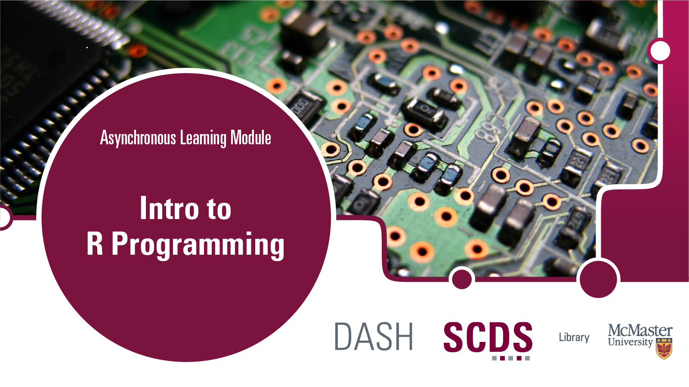

<!-- 
This will be the home page of your module. It should give a small introduction to the student about the workshop topic.
Add, edit, or remove any content below for the workshop in question. -->

<!-- Title slide image. Replace img src with your own, or comment this out. -->

<!-- Main header -->
# Introduction to R

R has a powerful suite of high-level statistical functions, but sometimes you need lower-level control over the functionality of your script. No prior knowledge of R is required.

Presentation by Isaac Kinley, DASH Support Assistant and PhD Candidate in Psychology, Neuroscience, and Behaviour. [Book an appointment with Isaac or another member of the DASH Team.](https://library.mcmaster.ca/services/dash)

## Prerequisites

- A local installation of R and RStudio (this will be covered in the Preparation page)

<!-- What will the student learn to do, learn to use, etc. -->
## Learning Objectives
By the end of this workshop, you will be able to:
- Understand what R is and what it can be used for
- Work with R's atomic data structures
- Use collections to store data
- Control the flow of a program using conditional statements and loops
- Create and use functions

<!-- Estimate the time the workshop will take to complete. Feel free to remove this. -->
## Duration
This module will take around 1 to 2 hours, however feel free to work at your own pace!

## Land Acknowledgement
We'd like to acknowledge that McMaster University sits on the Territories of the Mississauga and Haudenosaunee Nations, and within the lands protected by the Dish With One Spoon wampum agreement.
