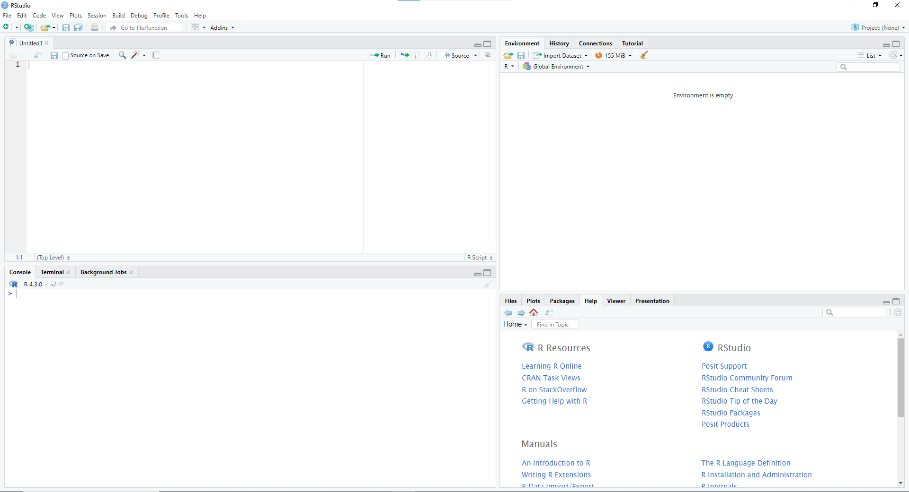
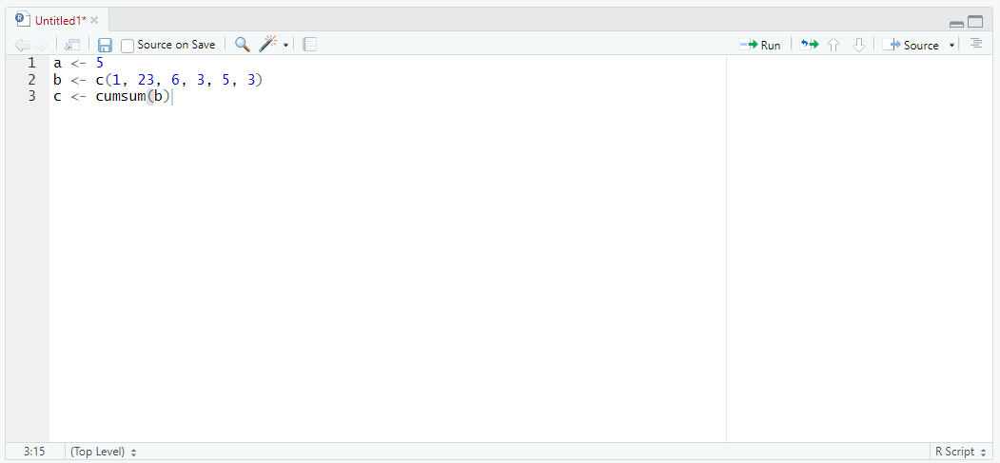
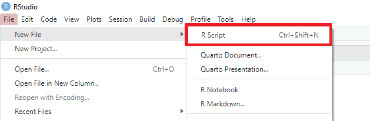
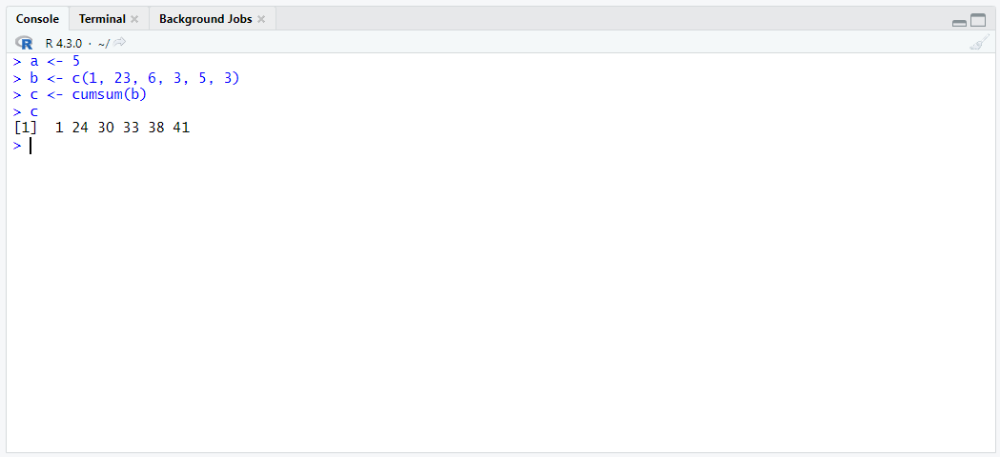
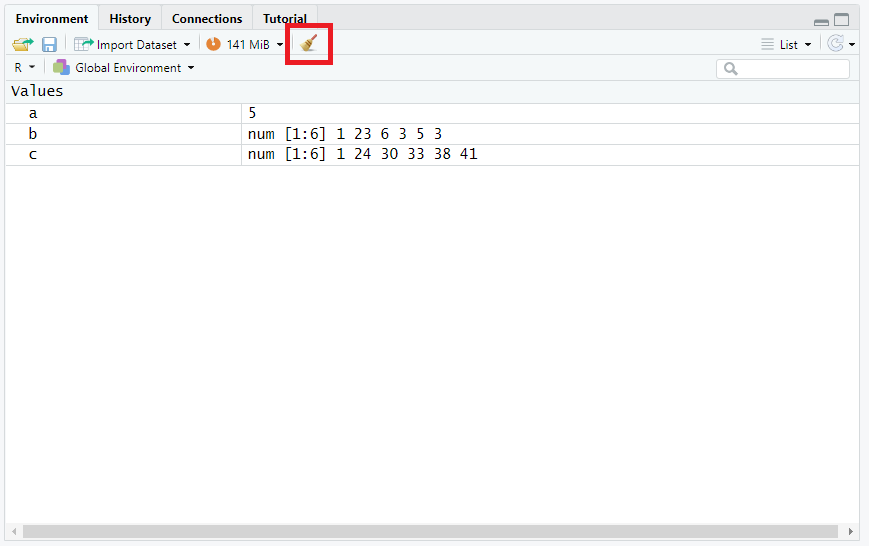
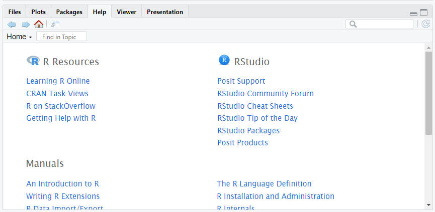
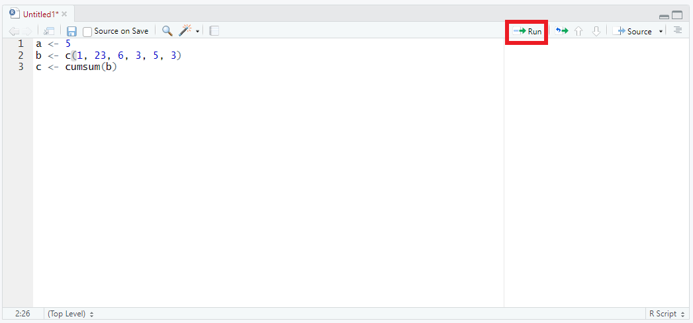
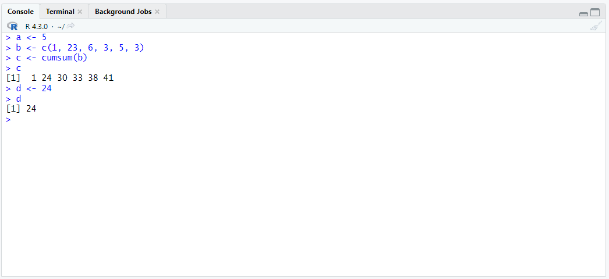
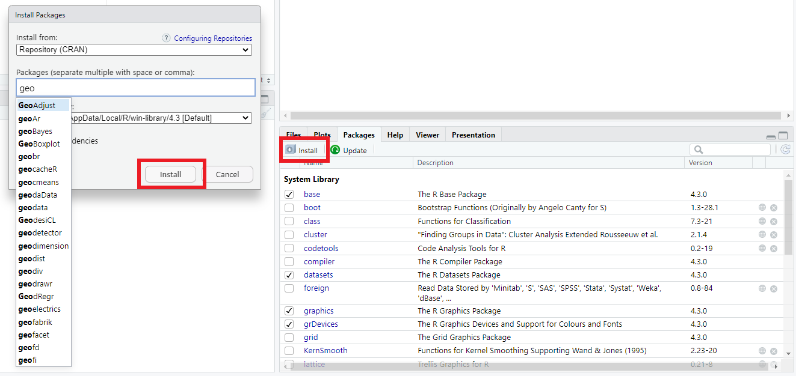
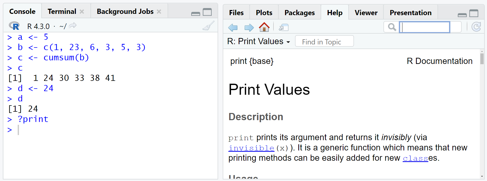

<!-- 
This page is an example lesson template.
Add, edit, or remove any content below for the workshop in question. -->

<!-- Putting a {: .no_toc} above a header removes it from the table of contents -->

{: .no_toc}  
# Lesson 0 - Using RStudio

This lesson will go over some of the functionality and features that RStudio provides.

<!-- This is your table of contents. You don't need to touch it, it automatically creates it when you add or remove headers. If you do not want a header to be included, put {: .no_toc } above the header line, as you can see above with Lesson 1 - Lesson Name. Make sure that there's also an empty line above {: .no_toc }... Markdown is picky about this :( -->

  

    Table of Contents
  

  {: .text-delta }
- TOC
{:toc}

<!-- Here are your learning objectives. Just like in the introduction, but more specific for this lesson. -->
## Lesson Objectives
- Understand how to use RStudio

<!-- A video for your lesson (if applicable) -->
<!-- ## Lesson Video
The following video demonstrates each of the steps outlined below in text.

<iframe height="416" width="100%" allowfullscreen frameborder=0 src="https://echo360.ca/media/a65689c0-c35c-4f33-9c12-f0ac97883f54/public?autoplay=false&automute=false"></iframe>
[View original here.](https://echo360.ca/media/a65689c0-c35c-4f33-9c12-f0ac97883f54/public?autoplay=false&automute=false) -->

<!-- Text content format for your lessons if you don't want to rely on videos, or want to provide another format of learning consumption. -->
## RStudio

A typical RStudio window has 4 important sections. The source code, the console, the environment, and a fourth section for files, plots, packages, or help.

### Source Code

This is the section where you'll be writing all your R code. You can also save your R code to a file to come back to it easily.

{: .note }
> If you don't see this section, go to `File` > `New File` > `R Script`. This should make the source code section appear.
> 
> 

### Console

The console will show you the output of your code and any errors that you may come about. You can also type R commands directly into the console to run them.

### Environment

In the environment section, you can see all currently stored data. If you want to start from a clean slate, you can use the brush button to wipe your environment clean.

### Other

This last section has everything else you might need. A file explorer window, an area to view plots/graphs, a list of currently installed packages, and a section to get help.

## Creating and Running Code

Any code you want to be able to rerun in the future should be written in the source code area and saved to a file.

To run a line of code, click on the line you want to run and click on the `Run` button.

Alternatively, you can also use the `Ctrl` + `Enter` keyboard shortcut.

If you want to run multiple lines of code at once (or the entire file), highlight the portions you want to run and use the `Run` button (or the shortcut) to run the code.

If you want to work with your data interactively, you can also run R commands in the console. This is most useful for testing and debugging purposes.

## Installing Packages

Packages are extensions to the R programming language. They provide additional functionality, whether that be datasets or functions. With R, you have access to [~20,000 packages](https://cran.r-project.org/web/packages/available_packages_by_name.html). 

To install packages in R, navigate to the `Packages` section in the bottom right area. You'll see a list of enabled and disabled installed packages. If you don't see the package you want, you can click on the `Install` button and search it by name.

## Getting Help

To get help with anything in the R programming language, you can use the help panel.

If you need help with a particular function, type `?functionName` in the console. This will open up the function's help page.

<!-- Summarize your learning objectives here. It acts as a reminder to the learner about what they just learned, as well as a checklist for you to make sure you covered everything you wished to cover. -->
## Key Points / Summary

- RStudio brings a lot of features to help with programming.
- You can type `?functionName` to get a help page for that function.
