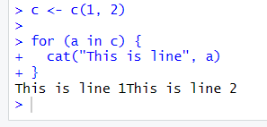
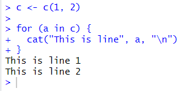

{: .no_toc}  
# Lesson 3c - Strings

The last atomic data type R has to offer are strings. Strings represent characters and text in R.

<details markdown="block">
  <summary>
    Table of Contents
  </summary>
  {: .text-delta }
- TOC
{:toc}
</details>

## Lesson Objectives
- Learn about strings
- Explore some of the functions R has to offer for strings.
- Concatenate strings and variables together.

<!-- ## Lesson Video
The following video demonstrates each of the steps outlined below in text.

<iframe height="416" width="100%" allowfullscreen frameborder=0 src="https://echo360.ca/media/a65689c0-c35c-4f33-9c12-f0ac97883f54/public?autoplay=false&automute=false"></iframe>
[View original here.](https://echo360.ca/media/a65689c0-c35c-4f33-9c12-f0ac97883f54/public?autoplay=false&automute=false) -->

## Creating a String
Strings in R need to be surrounded by double quotes " " or single quotes " "

{: .warning }
Don't mix and match! You can't have a string start with single quotes and end with double quotes.

<div class="code-example" markdown="1">

{: .label }
Input
```r
myString <- "Hello, World!"

myString
```

{: .label .label-green }
Output
```
[1] "Hello, World!"
```
</div>

## Using Quotations Inside Strings

If you need to use single quotes ' ', use double quotes " " to define the string.

```r
myString <- "I'm happy!"
```

If you need to use double quotes " ", use single quotes ' ' to define the string.

```r
myString <- 'He said "hello".'
```

If you need to use both single quotes ' ' and double quotes " ", you need to put a backslash \ before every quotation you defined the string with.

```r
myString <- "He said that \"He's happy\""
myString <- 'He said that "He\'s happy"'
```

## String Concatenation

In R, there are two ways to concatenate (combine) strings. One is using the `cat()` function, the other uses the `paste()` function.

### cat()
The `cat()` function can combine strings and variables together and display it in the console. This function is most often used to debug your code. It also gets rid of the quotation marks at the end, and turns any \" and \' to their proper quote.

<div class="code-example" markdown="1">

{: .label }
Input
```r
myString <- "Johnny"
myString2 <- "said that \"He's happy\"."

cat(myString, myString2)
```

{: .label .label-green }
Output
```
Johnny said that "He's happy".
```
</div>

{: .warning}
> `cat()` does not create a newline at the end of the string, so sometimes it creates some funky output like the following:
>
> 
>
> To avoid this, add `\n` at the end.
> 
> 
>
> Don't worry about the line with `for`. All it does is loop the code, we'll talk about it in [lesson 5.](lesson5)


By default, variables are seperated by a space when using `cat()`. You can remove this space if you add `sep=""` within the brackets.

<div class="code-example" markdown="1">

{: .label }
Input
```r
myString <- "Tes"
myString2 <- "ting"

cat(myString, myString2, sep="")
```

{: .label .label-green }
Output
```
Testing
```
</div>

### paste()
The other function that has the ability to concatenate variables together is `paste()`. It's similar to `cat()`, but it returns the new string. This allows you to save the output to a new variable.

<div class="code-example" markdown="1">

{: .label }
Input
```r
myString <- "The first number is"
myInt <- 2

myString2 <- paste(myString, myInt)

myString2
```

{: .label .label-green }
Output
```
[1] "The first number is 2"
```
</div>

Just like with `cat()`, you can use the `sep=""` tag to remove spaces between the variables.

## Other Useful String Functions

### Finding the Length of a String

The `nchar()` function returns the number of characters in a string.

<div class="code-example" markdown="1">

{: .label }
Input
```r
myString <- "Hello!"
nchar(myString)
```

{: .label .label-green }
Output
```
[1] 6
```
</div>

### Setting a String to UPPERCASE and lowercase

`toupper()` and `tolower()` converts a string to uppercase and lowercase.

<div class="code-example" markdown="1">

{: .label }
Input
```r
myString <- "Hello!"
toupper(myString)
tolower(myString)
```

{: .label .label-green }
Output
```
[1] "HELLO!"
[1] "hello!"
```
</div>

### Getting a Substring

The `substring()` function takes in a variable, the index of the first character, and the index of the last character to create a substring.

{: .note }
In R, indexing starts at 1. In `myString`, "H" is at index 1.

<div class="code-example" markdown="1">

{: .label }
Input
```r
myString <- "Hello!"
substring(myString, 3, 5)
```

{: .label .label-green }
Output
```
[1] "llo"
```
</div>

### Testing If a String Contains Another String

To test if a string contains another string, use `grepl(needle, haystack, fixed=TRUE)`. Change the needle and haystack to be the string you're searching for inside which string. If you are familiar with Regular Expression (RegEx) searching, you can get rid of `fixed=TRUE` to do a RegEx search.

{: .note }
`grepl(needle, haystack, fixed=TRUE)` is case-sensitive. 

<div class="code-example" markdown="1">

{: .label }
Input
```r
grepl("intro", "introduction to r", fixed=TRUE)
grepl("intro", "Introduction to R", fixed=TRUE)
grepl("intro", "machine learning with r: linear regression", fixed=TRUE)
```

{: .label .label-green }
Output
```
[1] TRUE
[1] FALSE
[1] FALSE
```
</div>

## Key Points / Summary
- Strings represent words and characters.
- The first character in a string is at index 1.
- You can concatenate variables together using `cat()` and `paste()`
