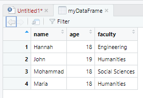

{: .no_toc}  
# Lesson 4e - Data Frames

Data frames are the last type of container that we'll be covering. 

<details markdown="block">
  <summary>
    Table of Contents
  </summary>
  {: .text-delta }
- TOC
{:toc}
</details>

## Lesson Objectives
- Use data frames to create two dimensional containers with elements of multiple data types

<!-- ## Lesson Video
The following video demonstrates each of the steps outlined below in text.

<iframe height="416" width="100%" allowfullscreen frameborder=0 src="https://echo360.ca/media/a65689c0-c35c-4f33-9c12-f0ac97883f54/public?autoplay=false&automute=false"></iframe>
[View original here.](https://echo360.ca/media/a65689c0-c35c-4f33-9c12-f0ac97883f54/public?autoplay=false&automute=false) -->

## What is a Data Frame?

A data frame is another type of container that can contain elements of different data types, like lists. However, data in the same column must have the same data type. They are also two dimensional, like matrices.

## Creating a Data Frame

The format to create a data frame is the following:

```r
myDataFrame = data.frame(
  columnName1 = c(value, value1, value2, ...),
  columnName2 = c(value3, value4, value5, ...),
  ... # and so on
)
```

Data frames behave a lot like tables, or Excel sheets. 

<div class="code-example" markdown="1">

{: .label }
Input
```r
myDataFrame = data.frame(
  name = c("Hannah", "John", "Mohammad", "Maria"),
  age = c(18, 19, 18, 18),
  faculty = c("Engineering", "Humanities", "Social Sciences", "Humanities")
)
myDataFrame
```

{: .label .label-green }
Output
```
      name age         faculty
1   Hannah  18     Engineering
2     John  19      Humanities
3 Mohammad  18 Social Sciences
4    Maria  18      Humanities
```
</div>

You can also use the `View()` function to open the data frame as a seperate tab.

<div class="code-example" markdown="1">

{: .label }
Input
```r
myDataFrame = data.frame(
  name = c("Hannah", "John", "Mohammad", "Maria"),
  age = c(18, 19, 18, 18),
  faculty = c("Engineering", "Humanities", "Social Sciences", "Humanities")
)
View(myDataFrame) # Take note of the capital V in "View"
```

{: .label .label-green }
Output

</div>

## Accessing Items in a Data Frame

Just like lists, data frames return data differently if you use `[` compared to `[[`.

<div class="code-example" markdown="1">

{: .label }
Input
```r
myDataFrame = data.frame(
  name = c("Hannah", "John", "Mohammad", "Maria"),
  age = c(18, 19, 18, 18),
  faculty = c("Engineering", "Humanities", "Social Sciences", "Humanities")
)

# accessing with a single [ returns a new data frame.
myDataFrame["name"]
```

{: .label .label-green }
Output
```
      name
1   Hannah
2     John
3 Mohammad
4    Maria
```
</div>

Using `[[` returns a vector of the column rather than a data frame.

<div class="code-example" markdown="1">

{: .label }
Input
```r
myDataFrame = data.frame(
  name = c("Hannah", "John", "Mohammad", "Maria"),
  age = c(18, 19, 18, 18),
  faculty = c("Engineering", "Humanities", "Social Sciences", "Humanities")
)

# accessing with a single [ returns a new data frame.
myDataFrame[["name"]]
```

{: .label .label-green }
Output
```
[1] "Hannah"   "John"     "Mohammad" "Maria"
```
</div>

## Accessing Items like a Matrix

You can also access items using the matrix notation.

```r
myDataFrame = data.frame(
  name = c("Hannah", "John", "Mohammad", "Maria"),
  age = c(18, 19, 18, 18),
  faculty = c("Engineering", "Humanities", "Social Sciences", "Humanities")
)

myDataFrame[1,"age"]       # gets the first item in the "age" column
myDataFrame[2,"name"]      # gets the second item in the "name" column

myDataFrame[2,]            # gets all items in row 2 as a data frame
myDataFrame[,"age"]        # gets all items in column 2 as a vector

myDataFrame[2,, drop=FALSE]        # gets all items in row 2 as a data frame
myDataFrame[,"age", drop=FALSE]        # gets all items in column 2 as a data frame

myDataFrame[c(1,2),]   # gets all items in rows 1 and 2 ]
myDataFrame[,"age"]       # gets all items except in column "age"

myDataFrame[,]         # gets all items
```

You can also refer to the columns by number (based on the order they come in).

```r
myDataFrame = data.frame(
  name = c("Hannah", "John", "Mohammad", "Maria"),
  age = c(18, 19, 18, 18),
  faculty = c("Engineering", "Humanities", "Social Sciences", "Humanities")
)

myDataFrame[,1]            # gets all items in the "name" column, because it's the first column 
```

## Modifying Values in a Data Frame

Modifying values in a data frame works just like any other container.

<div class="code-example" markdown="1">

{: .label }
Input
```r
myDataFrame = data.frame(
  name = c("Hannah", "John", "Mohammad", "Maria"),
  age = c(18, 19, 18, 18),
  faculty = c("Engineering", "Humanities", "Social Sciences", "Humanities")
)

myDataFrame[3, "age"] = 19
myDataFrame
```

{: .label .label-green }
Output
```
      name age         faculty
1   Hannah  18     Engineering
2     John  19      Humanities
3 Mohammad  19 Social Sciences
4    Maria  18      Humanities
```
</div>

## Adding Rows and Columns to a Data Frame

Just like matrices, you can add rows and columns to a data frame using the `cbind()` function for columns, and the `rbind()` function for rows.

<div class="code-example" markdown="1">

{: .label }
Input
```r
myDataFrame = data.frame(
  name = c("Hannah", "John", "Mohammad", "Maria"),
  age = c(18, 19, 18, 18),
  faculty = c("Engineering", "Humanities", "Social Sciences", "Humanities")
)
myDataFrame <- rbind(myDataFrame, list("Hank", 20, "Health Sciences"))
myDataFrame
```

{: .label .label-green }
Output
```
      name age         faculty
1   Hannah  18     Engineering
2     John  19      Humanities
3 Mohammad  18 Social Sciences
4    Maria  18      Humanities
5     Hank  20 Health Sciences
```
</div>

## Key Points / Summary

- You can use data frames to get a table-like data format.
- Columns in data frames must have the same data type (vectors), but the rows can have different data types (lists).