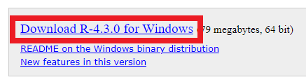

<!-- 
(OPTIONAL) This will be the page going over any installation or registration requirements.
Add, edit, or remove any content below for the workshop in question. 
-->

# Workshop preparation 

<!-- 
Seperate preparation into account creation, file downloads, and software downloads.
However, you can format this as you wish.
An example is provided below.
-->
## 1. Install R

Windows

- Navigate to <https://cran.rstudio.com/>.
- Click on `Download R for Windows`

- Click on `base`

- Click on `Download R... for Windows`

- Run the executable and install.

macOS

- Navigate to <https://cran.rstudio.com/>.
- Click on `Download R for macOS`

- Choose the correct install for your Mac.

Linux

- Navigate to <https://cran.rstudio.com/>.
- Click on `Download R for Linux`

- Choose your Linux distribution and follow the instructions provided.

## 2. Install RStudio

- Navigate to <https://posit.co/download/rstudio-desktop/>
- Download and install RStudio for your operating system.